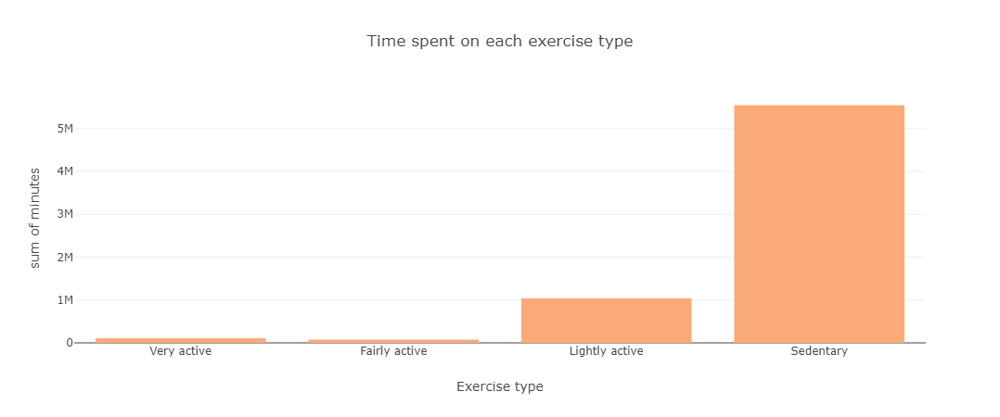

# Bellabeat Case Study with Python

This is my final project for the Google Professional Data Analytics Certificate. This project analyzes data from FitBit Fitness Tracker, which includes data from thirty users about their physical activity. The objetive of this analysis is to gain insight into how customers use their smart devices. These insights aim to uncover new growth opportunities for Bellabeat, a high-tech manufacturer of health-focused products for women. The dataset used for this project can be found at this [link](https://www.kaggle.com/datasets/arashnic/fitbit/data).

## Table of contents
1. [Introduction](#introduction)
    1. [Scenario](#scenario)
    1. [About the company](#about-the-company) 
    1. [Business task](#business-task)
    1. [Key stakeholders](#key-stakeholders)
1. [Data preparation](#data-preparation)
    1. [Dataset used in this project](#dataset-used-in-this-project)
    1. [Data organization](#data-organization)
1. [Data proccesing](#data-proccesing)
    1. [Activity dataframe](#activity-dataframe)
    1. [Calories, steps and sleep dataframes](#calories-steps-and-sleep-dataframes)
1. [Analysis](#analysis)
1. [Conclusions](#conclusions)

## Introduction

### Scenario
In this scenario, I'm a junior data analysis working on the marketing analyst team at Bellabeat, company which has a potential to became a larger player in the global smart device market. The CCO believes that analyzing smart device firness data could helo unlock new growth opportunities for the company, so I have been asked to focus on one smart device data and gain inisghts into how customers are using these smart devices. These insights willl help guide marketing strategy for the company.

### About the company

Bellabeat was founded by Urška Sršen and Sando Mur in 2013. It's a high-tech company that manufactures health-focused smart products, collecting data on activity, sleep, stress, and reproductive health that allowes Bellabeat to empower women with knowledge about their own health and habits.

### Business task
The business task is to identify user behavior patterns with smart devices to gather insights that can guide more effective marketing strategies.

### Key stakeholders
The main stakeholders here are:
* Urška Sršen, Bellabeat co-founder and Chief Creative Officer;
* Sando Mur, Mathematician and Bellabeat cofounder;
* Bellabeat marketing analytics team.

## Data preparation

### Dataset used in this project
[FitBit Fitness Tracker Data](https://www.kaggle.com/datasets/arashnic/fitbit/data) (CC0: Public Domain, dataset made available through Mobius): This [Kaggle](https://www.kaggle.com/) data set contains personal fitness tracker from thirty fitbit users. It includes information about daily activity, steps, and heart rate that can be used to explore users’ habits.
This dataset was generated by respondents to a distributed survey via Amazon Mechanical Turk between 03/12/2016 and 05/12/2016..

### Data organization
There are 18 documents available, but for this analysis I decided to use the following:
* dailyactivity_merged.csv
* hourlycalories_merged.csv
* hourlysteps_merged.csv
* sleepday_merged.csv

In the cases of the *dailyactivity_merged.csv*, *hourlycalories_merged.csv* and *hourlysteps_merged.csv*, the information was split into two separate datasets (one covering 03/12/2016 to 04/12/2016 and the other covering 04/12/2016 to 05/12/2016). I concatenated each pair of datasets into a single dataset.

In the case of the *sleepday_merged.csv*, there was only one dataset available.

## Data proccesing
The visualization tool used in this project was [Plotly](https://plotly.com/), and the library used for data manipulation was [Pandas](https://pandas.pydata.org/). 

For each datasets, the following cleaning steps were performed:
1. Checked for missing values
1. Checked for duplicate entries
1. Removed any duplicate entries found

### Activity dataframe

For the *activity* dataframe, two unpivoting processes were applied to make the data easier to plot:
1. Unpivoted columns: *'VeryActiveMinutes', 'FairlyActiveMinutes', 'LightlyActiveMinutes' and 'SedentaryMinutes'*. As a result, two new columns were created, *ActivityType* and *Minutes*.
1. Unpivoted columns *VeryActiveDistance*, *ModeratelyActiveDistance*, *LightActiveDistance* and *SedentaryActiveDistance*. As a result, two new columns, *DistanceWalkType* and *Distance*, were created.

From this dataframe, the avg_activity dataframe was created, containing averages and maximum values per user. It includes the average values for steps, distance, and calories, as well as the maximum value for steps.

### Calories, steps and sleep dataframes

I formatted the date and time, which were initially stored as an object type in a 12-hour format. I split them into two separate columns: one for the date and another for the time, converted to a 24-hour format. Subsequently, I filtered the columns of interest for each case.

From the sleep dataframe, the avg_sleep dataframe was created. This new dataframe contains the average values for time asleep and time in bed per user, making the analysis easier to visualize and plot. Additionally, two new columns were added: one for the total hours of sleep and another categorizing sleep duration into specific ranges.

## Analysis

### 1. Steps by day of the week

The days when users take the most steps during the week are Tuesdays, followed by Saturdays, while Sunday sees the fewest steps. Additionally, after Tuesday, the number of steps gradually decreases each day until Saturday, when users tend to become more active again.

###  2. Time spent on each exercise type

Users spend 82% of their time in sedentary activity, 15.3% in light exercise, and only around 1.11% and 1.63% in fairly active and very active exercise, respectively.

###  3. Distance covered by activity level

Users covered the greatest distance through light exercise (62.2%), followed by very active exercise (27.2%). Only 10.6% of the total distance is attributed to moderate and sedentary activity levels.

###  4. Max steps vs average distance by user

This plot represents the highest number of steps recorded by each user versus the average distance they cover. There is a linear correlation between these two indicators, showing that the greater the average distance, the higher the maximum number of steps a user takes.

###  5. Average calories vs average steps by user

This plot shows a slight trend indicating that users who take more average steps tend to burn more average calories.

### 6. Distribution of average steps by user

The average number of steps taken by users ranges from 4000 to 10000 steps.

###  7. Distribution of max steps by user

The highest number of steps taken by users falls between 10000 and 20000 steps.

###  8. Distribution of average calories by user

The majority of users burn an average of 1500 and 2000 calories.

###  9. Distribution of calories burned per hour

The data shows an increase in calories burned from 5:00 AM to 12:00 PM, followed by a dip around 3:00 PM. Calories burned then rise again until 7:00 PM before decreasing through the night.

###  10. Distribution of average steps per hour

Steps taken increase during the morning hours (5:00 AM to 12:00 PM), decrease around 3:00 PM, rise again until 7:00 PM, and then decline through the night.

###  11. Average sleep duration across days of the week

The highest average minutes asleep occur on Sundays, followed by Wednesdays. This aligns with the peaks in active minutes observed in Figure 1 on Tuesdays and Saturdays, possibly due to higher activity levels on those days.

###  12. Average time in bed vs average time asleep

The average sleep time for users ranges between 6 and 8 hours (66.9%). A notable 20.3% of users sleep less than 6 hours on average. Only 12.8% of users sleep more than 8 hours on average.

## Conclusions

Based on the results of the analysis, here are some recommendations for the company:

1. Since users spend only 2.7% of their time engaging in very active or fairly active exercise, the features in smart devices should encourage increased physical activity. For example, the devices could include movement reminders, personalized activity challenges, or gamified rewards for meeting exercise goals.
1. Marketing campaigns could align with users' behavior patterns, such as activity peaks on Tuesdays and Saturdays. For instance, promotions or challenges could target mid-week to encourage sustained activity, while Saturdays could be a focus for more intense engagement campaigns.
1. Many users sleep less than 6 hours, presenting an opportunity to promote healthy bedtime routines. Devices could suggest personalized bedtime schedules, relaxation techniques, and tips to improve sleep quality.
1. Segment users to target specific populations with tailored offers. For example, provide product recommendations for highly active users (e.g., advanced fitness features) and less active users (e.g., beginner-friendly tools or motivational programs).